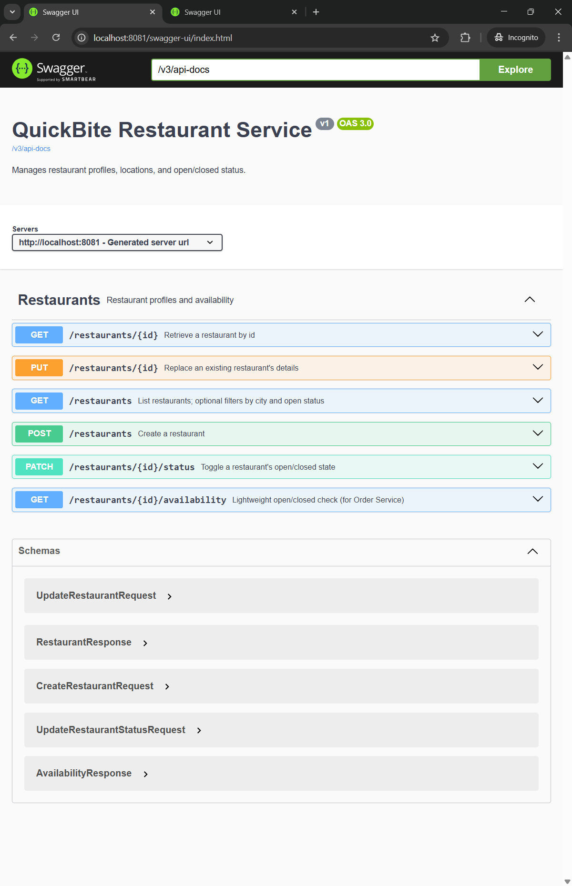
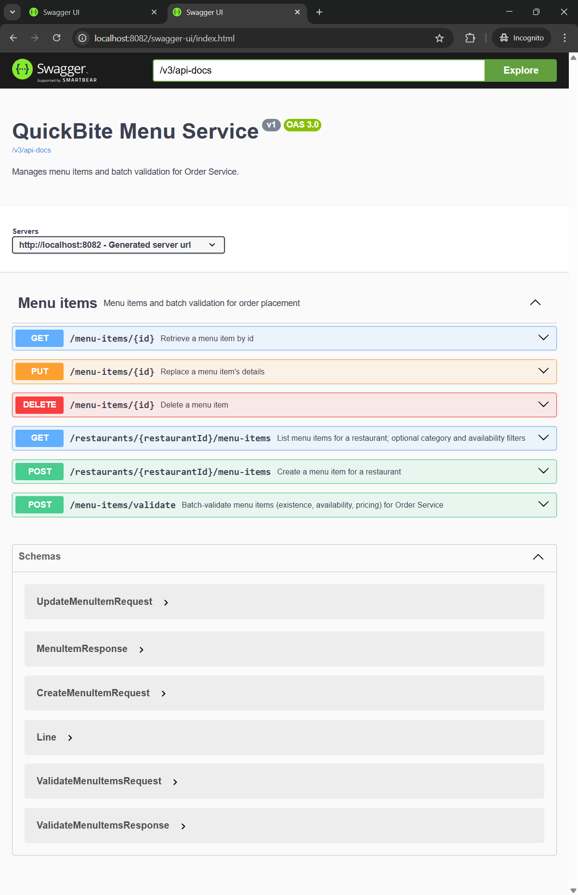
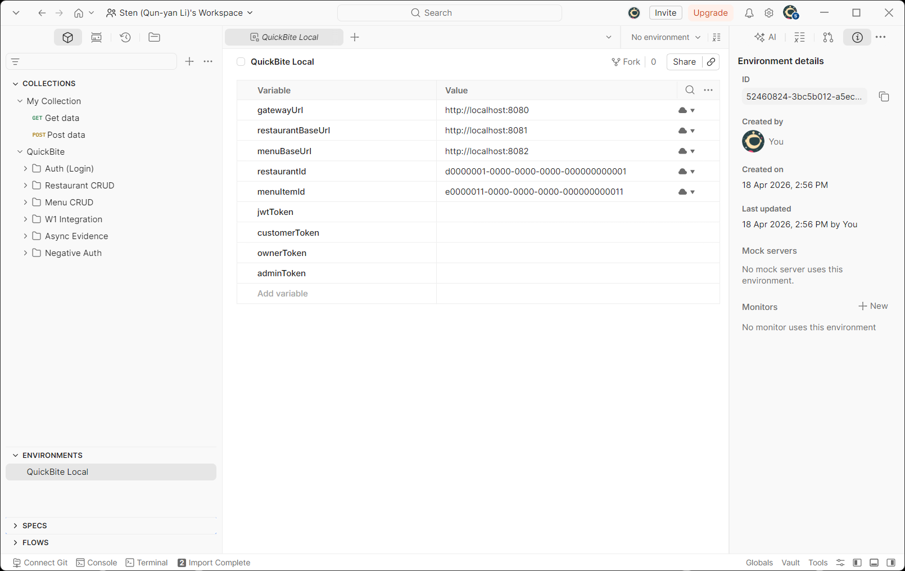

## Response to `dev-docs/verification/phase-2-to-6-verification_Golf-Papa-Tango.md`

### A. Prepare the local DB ports

Content of `services/local-dev/.env.local`:

```
# Copy this file to .env.local and fill in real values.
# .env.local is git-ignored; .env.example is tracked.

# --- Restaurant Service database ---
RESTAURANT_DB_NAME=restaurant_db
RESTAURANT_DB_USER=restaurant_user
RESTAURANT_DB_PASSWORD=restaurant_pw
RESTAURANT_DB_HOST_PORT=5442

# --- Menu Service database ---
MENU_DB_NAME=menu_db
MENU_DB_USER=menu_user
MENU_DB_PASSWORD=menu_pw
MENU_DB_HOST_PORT=5433

# --- JWT (HS256 shared secret for dev tokens) ---
# Base64-encoded 256-bit key. Regenerate with:
#   openssl rand -base64 32
# Do NOT reuse the placeholder in any shared/team/production environment.
JWT_SECRET=dGVzdC1zZWNyZXQtZm9yLWRldi1vbmx5LWRvLW5vdC11c2UtaW4tcHJvZC0xMjM0NTY=
JWT_ISSUER=quickbite-user-service

# --- Downstream service URLs ---
# Sierra-Lima's services do not call each other, but the env-var names
# are fixed so future phases only need to flip values.
RESTAURANT_SERVICE_URL=http://localhost:8081
MENU_SERVICE_URL=http://localhost:8082
```

### B. Start the two database containers

```
PS C:\MSc-Computer-Science\Semester-2\esi\2026-esi-quickbite-personal> cd C:\MSc-Computer-Science\Semester-2\esi\2026-esi-quickbite-personal\services\local-dev
PS C:\MSc-Computer-Science\Semester-2\esi\2026-esi-quickbite-personal\services\local-dev> docker compose --env-file .env.local up -d        
[+] up 2/2
 ✔ Container quickbite-menu-db       Running                                                                                                              0.0s
 ✔ Container quickbite-restaurant-db Running                                                                                                              0.0s
PS C:\MSc-Computer-Science\Semester-2\esi\2026-esi-quickbite-personal\services\local-dev> docker ps --format "table {{.Names}}\t{{.Status}}"
NAMES                     STATUS
quickbite-menu-db         Up 41 minutes (healthy)
quickbite-restaurant-db   Up 41 minutes (healthy)
PS C:\MSc-Computer-Science\Semester-2\esi\2026-esi-quickbite-personal\services\local-dev> 
```

### C. Start the two Spring Boot services in IntelliJ

#### Restaurant Service

```
"C:\Program Files\OpenLogic\jdk-21.0.10.7-hotspot\bin\java.exe" -XX:TieredStopAtLevel=1 -Dspring.output.ansi.enabled=always -Dcom.sun.management.jmxremote -Dspring.jmx.enabled=true -Dspring.liveBeansView.mbeanDomain -Dspring.application.admin.enabled=true "-Dmanagement.endpoints.jmx.exposure.include=*" "-javaagent:C:\Users\qunyan\AppData\Local\Programs\IntelliJ IDEA\lib\idea_rt.jar=50925" -Dfile.encoding=UTF-8 -Dsun.stdout.encoding=UTF-8 -Dsun.stderr.encoding=UTF-8 -classpath C:\MSc-Computer-Science\Semester-2\esi\2026-esi-quickbite-personal\services\restaurant-service\target\classes;C:\Users\qunyan\.m2\repository\org\springframework\boot\spring-boot-starter-web\3.3.4\spring-boot-starter-web-3.3.4.jar;C:\Users\qunyan\.m2\repository\org\springframework\boot\spring-boot-starter\3.3.4\spring-boot-starter-3.3.4.jar;C:\Users\qunyan\.m2\repository\org\springframework\boot\spring-boot-starter-logging\3.3.4\spring-boot-starter-logging-3.3.4.jar;C:\Users\qunyan\.m2\repository\ch\qos\logback\logback-classic\1.5.8\logback-classic-1.5.8.jar;C:\Users\qunyan\.m2\repository\ch\qos\logback\logback-core\1.5.8\logback-core-1.5.8.jar;C:\Users\qunyan\.m2\repository\org\apache\logging\log4j\log4j-to-slf4j\2.23.1\log4j-to-slf4j-2.23.1.jar;C:\Users\qunyan\.m2\repository\org\apache\logging\log4j\log4j-api\2.23.1\log4j-api-2.23.1.jar;C:\Users\qunyan\.m2\repository\org\slf4j\jul-to-slf4j\2.0.16\jul-to-slf4j-2.0.16.jar;C:\Users\qunyan\.m2\repository\jakarta\annotation\jakarta.annotation-api\2.1.1\jakarta.annotation-api-2.1.1.jar;C:\Users\qunyan\.m2\repository\org\yaml\snakeyaml\2.2\snakeyaml-2.2.jar;C:\Users\qunyan\.m2\repository\org\springframework\boot\spring-boot-starter-json\3.3.4\spring-boot-starter-json-3.3.4.jar;C:\Users\qunyan\.m2\repository\com\fasterxml\jackson\datatype\jackson-datatype-jdk8\2.17.2\jackson-datatype-jdk8-2.17.2.jar;C:\Users\qunyan\.m2\repository\com\fasterxml\jackson\datatype\jackson-datatype-jsr310\2.17.2\jackson-datatype-jsr310-2.17.2.jar;C:\Users\qunyan\.m2\repository\com\fasterxml\jackson\module\jackson-module-parameter-names\2.17.2\jackson-module-parameter-names-2.17.2.jar;C:\Users\qunyan\.m2\repository\org\springframework\boot\spring-boot-starter-tomcat\3.3.4\spring-boot-starter-tomcat-3.3.4.jar;C:\Users\qunyan\.m2\repository\org\apache\tomcat\embed\tomcat-embed-core\10.1.30\tomcat-embed-core-10.1.30.jar;C:\Users\qunyan\.m2\repository\org\apache\tomcat\embed\tomcat-embed-websocket\10.1.30\tomcat-embed-websocket-10.1.30.jar;C:\Users\qunyan\.m2\repository\org\springframework\spring-web\6.1.13\spring-web-6.1.13.jar;C:\Users\qunyan\.m2\repository\org\springframework\spring-beans\6.1.13\spring-beans-6.1.13.jar;C:\Users\qunyan\.m2\repository\org\springframework\spring-webmvc\6.1.13\spring-webmvc-6.1.13.jar;C:\Users\qunyan\.m2\repository\org\springframework\spring-context\6.1.13\spring-context-6.1.13.jar;C:\Users\qunyan\.m2\repository\org\springframework\spring-expression\6.1.13\spring-expression-6.1.13.jar;C:\Users\qunyan\.m2\repository\org\springframework\boot\spring-boot-starter-data-jpa\3.3.4\spring-boot-starter-data-jpa-3.3.4.jar;C:\Users\qunyan\.m2\repository\org\springframework\boot\spring-boot-starter-aop\3.3.4\spring-boot-starter-aop-3.3.4.jar;C:\Users\qunyan\.m2\repository\org\aspectj\aspectjweaver\1.9.22.1\aspectjweaver-1.9.22.1.jar;C:\Users\qunyan\.m2\repository\org\springframework\boot\spring-boot-starter-jdbc\3.3.4\spring-boot-starter-jdbc-3.3.4.jar;C:\Users\qunyan\.m2\repository\com\zaxxer\HikariCP\5.1.0\HikariCP-5.1.0.jar;C:\Users\qunyan\.m2\repository\org\springframework\spring-jdbc\6.1.13\spring-jdbc-6.1.13.jar;C:\Users\qunyan\.m2\repository\org\hibernate\orm\hibernate-core\6.5.3.Final\hibernate-core-6.5.3.Final.jar;C:\Users\qunyan\.m2\repository\jakarta\persistence\jakarta.persistence-api\3.1.0\jakarta.persistence-api-3.1.0.jar;C:\Users\qunyan\.m2\repository\jakarta\transaction\jakarta.transaction-api\2.0.1\jakarta.transaction-api-2.0.1.jar;C:\Users\qunyan\.m2\repository\org\jboss\logging\jboss-logging\3.5.3.Final\jboss-logging-3.5.3.Final.jar;C:\Users\qunyan\.m2\repository\org\hibernate\common\hibernate-commons-annotations\6.0.6.Final\hibernate-commons-annotations-6.0.6.Final.jar;C:\Users\qunyan\.m2\repository\io\smallrye\jandex\3.1.2\jandex-3.1.2.jar;C:\Users\qunyan\.m2\repository\com\fasterxml\classmate\1.7.0\classmate-1.7.0.jar;C:\Users\qunyan\.m2\repository\net\bytebuddy\byte-buddy\1.14.19\byte-buddy-1.14.19.jar;C:\Users\qunyan\.m2\repository\org\glassfish\jaxb\jaxb-runtime\4.0.5\jaxb-runtime-4.0.5.jar;C:\Users\qunyan\.m2\repository\org\glassfish\jaxb\jaxb-core\4.0.5\jaxb-core-4.0.5.jar;C:\Users\qunyan\.m2\repository\org\eclipse\angus\angus-activation\2.0.2\angus-activation-2.0.2.jar;C:\Users\qunyan\.m2\repository\org\glassfish\jaxb\txw2\4.0.5\txw2-4.0.5.jar;C:\Users\qunyan\.m2\repository\com\sun\istack\istack-commons-runtime\4.1.2\istack-commons-runtime-4.1.2.jar;C:\Users\qunyan\.m2\repository\jakarta\inject\jakarta.inject-api\2.0.1\jakarta.inject-api-2.0.1.jar;C:\Users\qunyan\.m2\repository\org\antlr\antlr4-runtime\4.13.0\antlr4-runtime-4.13.0.jar;C:\Users\qunyan\.m2\repository\org\springframework\data\spring-data-jpa\3.3.4\spring-data-jpa-3.3.4.jar;C:\Users\qunyan\.m2\repository\org\springframework\data\spring-data-commons\3.3.4\spring-data-commons-3.3.4.jar;C:\Users\qunyan\.m2\repository\org\springframework\spring-orm\6.1.13\spring-orm-6.1.13.jar;C:\Users\qunyan\.m2\repository\org\springframework\spring-tx\6.1.13\spring-tx-6.1.13.jar;C:\Users\qunyan\.m2\repository\org\slf4j\slf4j-api\2.0.16\slf4j-api-2.0.16.jar;C:\Users\qunyan\.m2\repository\org\springframework\spring-aspects\6.1.13\spring-aspects-6.1.13.jar;C:\Users\qunyan\.m2\repository\org\springframework\boot\spring-boot-starter-validation\3.3.4\spring-boot-starter-validation-3.3.4.jar;C:\Users\qunyan\.m2\repository\org\apache\tomcat\embed\tomcat-embed-el\10.1.30\tomcat-embed-el-10.1.30.jar;C:\Users\qunyan\.m2\repository\org\hibernate\validator\hibernate-validator\8.0.1.Final\hibernate-validator-8.0.1.Final.jar;C:\Users\qunyan\.m2\repository\jakarta\validation\jakarta.validation-api\3.0.2\jakarta.validation-api-3.0.2.jar;C:\Users\qunyan\.m2\repository\org\springframework\boot\spring-boot-starter-security\3.3.4\spring-boot-starter-security-3.3.4.jar;C:\Users\qunyan\.m2\repository\org\springframework\spring-aop\6.1.13\spring-aop-6.1.13.jar;C:\Users\qunyan\.m2\repository\org\springframework\security\spring-security-config\6.3.3\spring-security-config-6.3.3.jar;C:\Users\qunyan\.m2\repository\org\springframework\security\spring-security-web\6.3.3\spring-security-web-6.3.3.jar;C:\Users\qunyan\.m2\repository\org\springframework\boot\spring-boot-starter-actuator\3.3.4\spring-boot-starter-actuator-3.3.4.jar;C:\Users\qunyan\.m2\repository\org\springframework\boot\spring-boot-actuator-autoconfigure\3.3.4\spring-boot-actuator-autoconfigure-3.3.4.jar;C:\Users\qunyan\.m2\repository\org\springframework\boot\spring-boot-actuator\3.3.4\spring-boot-actuator-3.3.4.jar;C:\Users\qunyan\.m2\repository\io\micrometer\micrometer-observation\1.13.4\micrometer-observation-1.13.4.jar;C:\Users\qunyan\.m2\repository\io\micrometer\micrometer-commons\1.13.4\micrometer-commons-1.13.4.jar;C:\Users\qunyan\.m2\repository\io\micrometer\micrometer-jakarta9\1.13.4\micrometer-jakarta9-1.13.4.jar;C:\Users\qunyan\.m2\repository\io\micrometer\micrometer-core\1.13.4\micrometer-core-1.13.4.jar;C:\Users\qunyan\.m2\repository\org\hdrhistogram\HdrHistogram\2.2.2\HdrHistogram-2.2.2.jar;C:\Users\qunyan\.m2\repository\org\latencyutils\LatencyUtils\2.0.3\LatencyUtils-2.0.3.jar;C:\Users\qunyan\.m2\repository\org\flywaydb\flyway-core\10.10.0\flyway-core-10.10.0.jar;C:\Users\qunyan\.m2\repository\com\fasterxml\jackson\dataformat\jackson-dataformat-toml\2.17.2\jackson-dataformat-toml-2.17.2.jar;C:\Users\qunyan\.m2\repository\com\fasterxml\jackson\core\jackson-core\2.17.2\jackson-core-2.17.2.jar;C:\Users\qunyan\.m2\repository\com\google\code\gson\gson\2.10.1\gson-2.10.1.jar;C:\Users\qunyan\.m2\repository\org\flywaydb\flyway-database-postgresql\10.10.0\flyway-database-postgresql-10.10.0.jar;C:\Users\qunyan\.m2\repository\org\postgresql\postgresql\42.7.4\postgresql-42.7.4.jar;C:\Users\qunyan\.m2\repository\org\checkerframework\checker-qual\3.42.0\checker-qual-3.42.0.jar;C:\Users\qunyan\.m2\repository\io\jsonwebtoken\jjwt-api\0.11.5\jjwt-api-0.11.5.jar;C:\Users\qunyan\.m2\repository\io\jsonwebtoken\jjwt-impl\0.11.5\jjwt-impl-0.11.5.jar;C:\Users\qunyan\.m2\repository\io\jsonwebtoken\jjwt-jackson\0.11.5\jjwt-jackson-0.11.5.jar;C:\Users\qunyan\.m2\repository\com\fasterxml\jackson\core\jackson-databind\2.17.2\jackson-databind-2.17.2.jar;C:\Users\qunyan\.m2\repository\com\fasterxml\jackson\core\jackson-annotations\2.17.2\jackson-annotations-2.17.2.jar;C:\Users\qunyan\.m2\repository\org\springdoc\springdoc-openapi-starter-webmvc-ui\2.5.0\springdoc-openapi-starter-webmvc-ui-2.5.0.jar;C:\Users\qunyan\.m2\repository\org\springdoc\springdoc-openapi-starter-webmvc-api\2.5.0\springdoc-openapi-starter-webmvc-api-2.5.0.jar;C:\Users\qunyan\.m2\repository\org\springdoc\springdoc-openapi-starter-common\2.5.0\springdoc-openapi-starter-common-2.5.0.jar;C:\Users\qunyan\.m2\repository\io\swagger\core\v3\swagger-core-jakarta\2.2.21\swagger-core-jakarta-2.2.21.jar;C:\Users\qunyan\.m2\repository\org\apache\commons\commons-lang3\3.14.0\commons-lang3-3.14.0.jar;C:\Users\qunyan\.m2\repository\io\swagger\core\v3\swagger-annotations-jakarta\2.2.21\swagger-annotations-jakarta-2.2.21.jar;C:\Users\qunyan\.m2\repository\io\swagger\core\v3\swagger-models-jakarta\2.2.21\swagger-models-jakarta-2.2.21.jar;C:\Users\qunyan\.m2\repository\com\fasterxml\jackson\dataformat\jackson-dataformat-yaml\2.17.2\jackson-dataformat-yaml-2.17.2.jar;C:\Users\qunyan\.m2\repository\org\webjars\swagger-ui\5.13.0\swagger-ui-5.13.0.jar;C:\Users\qunyan\.m2\repository\org\projectlombok\lombok\1.18.34\lombok-1.18.34.jar;C:\Users\qunyan\.m2\repository\org\springframework\boot\spring-boot-devtools\3.3.4\spring-boot-devtools-3.3.4.jar;C:\Users\qunyan\.m2\repository\org\springframework\boot\spring-boot\3.3.4\spring-boot-3.3.4.jar;C:\Users\qunyan\.m2\repository\org\springframework\boot\spring-boot-autoconfigure\3.3.4\spring-boot-autoconfigure-3.3.4.jar;C:\Users\qunyan\.m2\repository\jakarta\xml\bind\jakarta.xml.bind-api\4.0.2\jakarta.xml.bind-api-4.0.2.jar;C:\Users\qunyan\.m2\repository\jakarta\activation\jakarta.activation-api\2.1.3\jakarta.activation-api-2.1.3.jar;C:\Users\qunyan\.m2\repository\org\springframework\spring-core\6.1.13\spring-core-6.1.13.jar;C:\Users\qunyan\.m2\repository\org\springframework\spring-jcl\6.1.13\spring-jcl-6.1.13.jar;C:\Users\qunyan\.m2\repository\org\springframework\security\spring-security-core\6.3.3\spring-security-core-6.3.3.jar;C:\Users\qunyan\.m2\repository\org\springframework\security\spring-security-crypto\6.3.3\spring-security-crypto-6.3.3.jar ee.ut.esi.quickbite.restaurant.RestaurantServiceApplication

  .   ____          _            __ _ _
 /\\ / ___'_ __ _ _(_)_ __  __ _ \ \ \ \
( ( )\___ | '_ | '_| | '_ \/ _` | \ \ \ \
 \\/  ___)| |_)| | | | | || (_| |  ) ) ) )
  '  |____| .__|_| |_|_| |_\__, | / / / /
 =========|_|==============|___/=/_/_/_/

 :: Spring Boot ::                (v3.3.4)

2026-04-18T14:43:27.611+03:00  INFO 22936 --- [restaurant-service] [  restartedMain] e.u.e.q.r.RestaurantServiceApplication   : Starting RestaurantServiceApplication using Java 21.0.10 with PID 22936 (C:\MSc-Computer-Science\Semester-2\esi\2026-esi-quickbite-personal\services\restaurant-service\target\classes started by qunyan in C:\MSc-Computer-Science\Semester-2\esi\2026-esi-quickbite-personal)
2026-04-18T14:43:27.613+03:00  INFO 22936 --- [restaurant-service] [  restartedMain] e.u.e.q.r.RestaurantServiceApplication   : No active profile set, falling back to 1 default profile: "default"
2026-04-18T14:43:27.652+03:00  INFO 22936 --- [restaurant-service] [  restartedMain] .e.DevToolsPropertyDefaultsPostProcessor : Devtools property defaults active! Set 'spring.devtools.add-properties' to 'false' to disable
2026-04-18T14:43:27.652+03:00  INFO 22936 --- [restaurant-service] [  restartedMain] .e.DevToolsPropertyDefaultsPostProcessor : For additional web related logging consider setting the 'logging.level.web' property to 'DEBUG'
2026-04-18T14:43:28.436+03:00  INFO 22936 --- [restaurant-service] [  restartedMain] .s.d.r.c.RepositoryConfigurationDelegate : Bootstrapping Spring Data JPA repositories in DEFAULT mode.
2026-04-18T14:43:28.467+03:00  INFO 22936 --- [restaurant-service] [  restartedMain] .s.d.r.c.RepositoryConfigurationDelegate : Finished Spring Data repository scanning in 27 ms. Found 1 JPA repository interface.
2026-04-18T14:43:28.970+03:00  INFO 22936 --- [restaurant-service] [  restartedMain] o.s.b.w.embedded.tomcat.TomcatWebServer  : Tomcat initialized with port 8081 (http)
2026-04-18T14:43:28.978+03:00  INFO 22936 --- [restaurant-service] [  restartedMain] o.apache.catalina.core.StandardService   : Starting service [Tomcat]
2026-04-18T14:43:28.978+03:00  INFO 22936 --- [restaurant-service] [  restartedMain] o.apache.catalina.core.StandardEngine    : Starting Servlet engine: [Apache Tomcat/10.1.30]
2026-04-18T14:43:29.020+03:00  INFO 22936 --- [restaurant-service] [  restartedMain] o.a.c.c.C.[Tomcat].[localhost].[/]       : Initializing Spring embedded WebApplicationContext
2026-04-18T14:43:29.020+03:00  INFO 22936 --- [restaurant-service] [  restartedMain] w.s.c.ServletWebServerApplicationContext : Root WebApplicationContext: initialization completed in 1368 ms
2026-04-18T14:43:29.259+03:00  INFO 22936 --- [restaurant-service] [  restartedMain] com.zaxxer.hikari.HikariDataSource       : HikariPool-1 - Starting...
2026-04-18T14:43:29.360+03:00  INFO 22936 --- [restaurant-service] [  restartedMain] com.zaxxer.hikari.pool.HikariPool        : HikariPool-1 - Added connection org.postgresql.jdbc.PgConnection@788c1e
2026-04-18T14:43:29.361+03:00  INFO 22936 --- [restaurant-service] [  restartedMain] com.zaxxer.hikari.HikariDataSource       : HikariPool-1 - Start completed.
2026-04-18T14:43:29.391+03:00  INFO 22936 --- [restaurant-service] [  restartedMain] org.flywaydb.core.FlywayExecutor         : Database: jdbc:postgresql://localhost:5442/restaurant_db (PostgreSQL 15.17)
2026-04-18T14:43:29.460+03:00  INFO 22936 --- [restaurant-service] [  restartedMain] o.f.core.internal.command.DbValidate     : Successfully validated 1 migration (execution time 00:00.035s)
2026-04-18T14:43:29.499+03:00  INFO 22936 --- [restaurant-service] [  restartedMain] o.f.core.internal.command.DbMigrate      : Current version of schema "public": 1
2026-04-18T14:43:29.504+03:00  INFO 22936 --- [restaurant-service] [  restartedMain] o.f.core.internal.command.DbMigrate      : Schema "public" is up to date. No migration necessary.
2026-04-18T14:43:29.576+03:00  INFO 22936 --- [restaurant-service] [  restartedMain] o.hibernate.jpa.internal.util.LogHelper  : HHH000204: Processing PersistenceUnitInfo [name: default]
2026-04-18T14:43:29.609+03:00  INFO 22936 --- [restaurant-service] [  restartedMain] org.hibernate.Version                    : HHH000412: Hibernate ORM core version 6.5.3.Final
2026-04-18T14:43:29.628+03:00  INFO 22936 --- [restaurant-service] [  restartedMain] o.h.c.internal.RegionFactoryInitiator    : HHH000026: Second-level cache disabled
2026-04-18T14:43:29.813+03:00  INFO 22936 --- [restaurant-service] [  restartedMain] o.s.o.j.p.SpringPersistenceUnitInfo      : No LoadTimeWeaver setup: ignoring JPA class transformer
2026-04-18T14:43:29.859+03:00  WARN 22936 --- [restaurant-service] [  restartedMain] org.hibernate.orm.deprecation            : HHH90000025: PostgreSQLDialect does not need to be specified explicitly using 'hibernate.dialect' (remove the property setting and it will be selected by default)
2026-04-18T14:43:30.424+03:00  INFO 22936 --- [restaurant-service] [  restartedMain] o.h.e.t.j.p.i.JtaPlatformInitiator       : HHH000489: No JTA platform available (set 'hibernate.transaction.jta.platform' to enable JTA platform integration)
2026-04-18T14:43:30.462+03:00  INFO 22936 --- [restaurant-service] [  restartedMain] j.LocalContainerEntityManagerFactoryBean : Initialized JPA EntityManagerFactory for persistence unit 'default'
2026-04-18T14:43:30.642+03:00  INFO 22936 --- [restaurant-service] [  restartedMain] o.s.d.j.r.query.QueryEnhancerFactory     : Hibernate is in classpath; If applicable, HQL parser will be used.
2026-04-18T14:43:31.071+03:00  WARN 22936 --- [restaurant-service] [  restartedMain] .s.s.UserDetailsServiceAutoConfiguration : 

Using generated security password: 92700717-6564-4944-9482-8714d43b6f2f

This generated password is for development use only. Your security configuration must be updated before running your application in production.

2026-04-18T14:43:31.080+03:00  INFO 22936 --- [restaurant-service] [  restartedMain] r$InitializeUserDetailsManagerConfigurer : Global AuthenticationManager configured with UserDetailsService bean with name inMemoryUserDetailsManager
2026-04-18T14:43:31.383+03:00  INFO 22936 --- [restaurant-service] [  restartedMain] o.s.b.a.e.web.EndpointLinksResolver      : Exposing 2 endpoints beneath base path '/actuator'
2026-04-18T14:43:31.797+03:00  INFO 22936 --- [restaurant-service] [  restartedMain] o.s.b.d.a.OptionalLiveReloadServer       : LiveReload server is running on port 35729
2026-04-18T14:43:31.848+03:00  INFO 22936 --- [restaurant-service] [  restartedMain] o.s.b.w.embedded.tomcat.TomcatWebServer  : Tomcat started on port 8081 (http) with context path '/'
2026-04-18T14:43:31.856+03:00  INFO 22936 --- [restaurant-service] [  restartedMain] e.u.e.q.r.RestaurantServiceApplication   : Started RestaurantServiceApplication in 4.603 seconds (process running for 5.121)
2026-04-18T14:43:32.479+03:00  INFO 22936 --- [restaurant-service] [)-172.31.144.60] o.a.c.c.C.[Tomcat].[localhost].[/]       : Initializing Spring DispatcherServlet 'dispatcherServlet'
2026-04-18T14:43:32.479+03:00  INFO 22936 --- [restaurant-service] [)-172.31.144.60] o.s.web.servlet.DispatcherServlet        : Initializing Servlet 'dispatcherServlet'
2026-04-18T14:43:32.482+03:00  INFO 22936 --- [restaurant-service] [)-172.31.144.60] o.s.web.servlet.DispatcherServlet        : Completed initialization in 2 ms
```

#### Menu Service

```
"C:\Program Files\OpenLogic\jdk-21.0.10.7-hotspot\bin\java.exe" -XX:TieredStopAtLevel=1 -Dspring.output.ansi.enabled=always -Dcom.sun.management.jmxremote -Dspring.jmx.enabled=true -Dspring.liveBeansView.mbeanDomain -Dspring.application.admin.enabled=true "-Dmanagement.endpoints.jmx.exposure.include=*" "-javaagent:C:\Users\qunyan\AppData\Local\Programs\IntelliJ IDEA\lib\idea_rt.jar=52817" -Dfile.encoding=UTF-8 -Dsun.stdout.encoding=UTF-8 -Dsun.stderr.encoding=UTF-8 -classpath C:\MSc-Computer-Science\Semester-2\esi\2026-esi-quickbite-personal\services\menu-service\target\classes;C:\Users\qunyan\.m2\repository\org\springframework\boot\spring-boot-starter-web\3.3.4\spring-boot-starter-web-3.3.4.jar;C:\Users\qunyan\.m2\repository\org\springframework\boot\spring-boot-starter\3.3.4\spring-boot-starter-3.3.4.jar;C:\Users\qunyan\.m2\repository\org\springframework\boot\spring-boot-starter-logging\3.3.4\spring-boot-starter-logging-3.3.4.jar;C:\Users\qunyan\.m2\repository\ch\qos\logback\logback-classic\1.5.8\logback-classic-1.5.8.jar;C:\Users\qunyan\.m2\repository\ch\qos\logback\logback-core\1.5.8\logback-core-1.5.8.jar;C:\Users\qunyan\.m2\repository\org\apache\logging\log4j\log4j-to-slf4j\2.23.1\log4j-to-slf4j-2.23.1.jar;C:\Users\qunyan\.m2\repository\org\apache\logging\log4j\log4j-api\2.23.1\log4j-api-2.23.1.jar;C:\Users\qunyan\.m2\repository\org\slf4j\jul-to-slf4j\2.0.16\jul-to-slf4j-2.0.16.jar;C:\Users\qunyan\.m2\repository\jakarta\annotation\jakarta.annotation-api\2.1.1\jakarta.annotation-api-2.1.1.jar;C:\Users\qunyan\.m2\repository\org\yaml\snakeyaml\2.2\snakeyaml-2.2.jar;C:\Users\qunyan\.m2\repository\org\springframework\boot\spring-boot-starter-json\3.3.4\spring-boot-starter-json-3.3.4.jar;C:\Users\qunyan\.m2\repository\com\fasterxml\jackson\datatype\jackson-datatype-jdk8\2.17.2\jackson-datatype-jdk8-2.17.2.jar;C:\Users\qunyan\.m2\repository\com\fasterxml\jackson\datatype\jackson-datatype-jsr310\2.17.2\jackson-datatype-jsr310-2.17.2.jar;C:\Users\qunyan\.m2\repository\com\fasterxml\jackson\module\jackson-module-parameter-names\2.17.2\jackson-module-parameter-names-2.17.2.jar;C:\Users\qunyan\.m2\repository\org\springframework\boot\spring-boot-starter-tomcat\3.3.4\spring-boot-starter-tomcat-3.3.4.jar;C:\Users\qunyan\.m2\repository\org\apache\tomcat\embed\tomcat-embed-core\10.1.30\tomcat-embed-core-10.1.30.jar;C:\Users\qunyan\.m2\repository\org\apache\tomcat\embed\tomcat-embed-websocket\10.1.30\tomcat-embed-websocket-10.1.30.jar;C:\Users\qunyan\.m2\repository\org\springframework\spring-web\6.1.13\spring-web-6.1.13.jar;C:\Users\qunyan\.m2\repository\org\springframework\spring-beans\6.1.13\spring-beans-6.1.13.jar;C:\Users\qunyan\.m2\repository\org\springframework\spring-webmvc\6.1.13\spring-webmvc-6.1.13.jar;C:\Users\qunyan\.m2\repository\org\springframework\spring-context\6.1.13\spring-context-6.1.13.jar;C:\Users\qunyan\.m2\repository\org\springframework\spring-expression\6.1.13\spring-expression-6.1.13.jar;C:\Users\qunyan\.m2\repository\org\springframework\boot\spring-boot-starter-data-jpa\3.3.4\spring-boot-starter-data-jpa-3.3.4.jar;C:\Users\qunyan\.m2\repository\org\springframework\boot\spring-boot-starter-aop\3.3.4\spring-boot-starter-aop-3.3.4.jar;C:\Users\qunyan\.m2\repository\org\aspectj\aspectjweaver\1.9.22.1\aspectjweaver-1.9.22.1.jar;C:\Users\qunyan\.m2\repository\org\springframework\boot\spring-boot-starter-jdbc\3.3.4\spring-boot-starter-jdbc-3.3.4.jar;C:\Users\qunyan\.m2\repository\com\zaxxer\HikariCP\5.1.0\HikariCP-5.1.0.jar;C:\Users\qunyan\.m2\repository\org\springframework\spring-jdbc\6.1.13\spring-jdbc-6.1.13.jar;C:\Users\qunyan\.m2\repository\org\hibernate\orm\hibernate-core\6.5.3.Final\hibernate-core-6.5.3.Final.jar;C:\Users\qunyan\.m2\repository\jakarta\persistence\jakarta.persistence-api\3.1.0\jakarta.persistence-api-3.1.0.jar;C:\Users\qunyan\.m2\repository\jakarta\transaction\jakarta.transaction-api\2.0.1\jakarta.transaction-api-2.0.1.jar;C:\Users\qunyan\.m2\repository\org\jboss\logging\jboss-logging\3.5.3.Final\jboss-logging-3.5.3.Final.jar;C:\Users\qunyan\.m2\repository\org\hibernate\common\hibernate-commons-annotations\6.0.6.Final\hibernate-commons-annotations-6.0.6.Final.jar;C:\Users\qunyan\.m2\repository\io\smallrye\jandex\3.1.2\jandex-3.1.2.jar;C:\Users\qunyan\.m2\repository\com\fasterxml\classmate\1.7.0\classmate-1.7.0.jar;C:\Users\qunyan\.m2\repository\net\bytebuddy\byte-buddy\1.14.19\byte-buddy-1.14.19.jar;C:\Users\qunyan\.m2\repository\org\glassfish\jaxb\jaxb-runtime\4.0.5\jaxb-runtime-4.0.5.jar;C:\Users\qunyan\.m2\repository\org\glassfish\jaxb\jaxb-core\4.0.5\jaxb-core-4.0.5.jar;C:\Users\qunyan\.m2\repository\org\eclipse\angus\angus-activation\2.0.2\angus-activation-2.0.2.jar;C:\Users\qunyan\.m2\repository\org\glassfish\jaxb\txw2\4.0.5\txw2-4.0.5.jar;C:\Users\qunyan\.m2\repository\com\sun\istack\istack-commons-runtime\4.1.2\istack-commons-runtime-4.1.2.jar;C:\Users\qunyan\.m2\repository\jakarta\inject\jakarta.inject-api\2.0.1\jakarta.inject-api-2.0.1.jar;C:\Users\qunyan\.m2\repository\org\antlr\antlr4-runtime\4.13.0\antlr4-runtime-4.13.0.jar;C:\Users\qunyan\.m2\repository\org\springframework\data\spring-data-jpa\3.3.4\spring-data-jpa-3.3.4.jar;C:\Users\qunyan\.m2\repository\org\springframework\data\spring-data-commons\3.3.4\spring-data-commons-3.3.4.jar;C:\Users\qunyan\.m2\repository\org\springframework\spring-orm\6.1.13\spring-orm-6.1.13.jar;C:\Users\qunyan\.m2\repository\org\springframework\spring-tx\6.1.13\spring-tx-6.1.13.jar;C:\Users\qunyan\.m2\repository\org\slf4j\slf4j-api\2.0.16\slf4j-api-2.0.16.jar;C:\Users\qunyan\.m2\repository\org\springframework\spring-aspects\6.1.13\spring-aspects-6.1.13.jar;C:\Users\qunyan\.m2\repository\org\springframework\boot\spring-boot-starter-validation\3.3.4\spring-boot-starter-validation-3.3.4.jar;C:\Users\qunyan\.m2\repository\org\apache\tomcat\embed\tomcat-embed-el\10.1.30\tomcat-embed-el-10.1.30.jar;C:\Users\qunyan\.m2\repository\org\hibernate\validator\hibernate-validator\8.0.1.Final\hibernate-validator-8.0.1.Final.jar;C:\Users\qunyan\.m2\repository\jakarta\validation\jakarta.validation-api\3.0.2\jakarta.validation-api-3.0.2.jar;C:\Users\qunyan\.m2\repository\org\springframework\boot\spring-boot-starter-security\3.3.4\spring-boot-starter-security-3.3.4.jar;C:\Users\qunyan\.m2\repository\org\springframework\spring-aop\6.1.13\spring-aop-6.1.13.jar;C:\Users\qunyan\.m2\repository\org\springframework\security\spring-security-config\6.3.3\spring-security-config-6.3.3.jar;C:\Users\qunyan\.m2\repository\org\springframework\security\spring-security-web\6.3.3\spring-security-web-6.3.3.jar;C:\Users\qunyan\.m2\repository\org\springframework\boot\spring-boot-starter-actuator\3.3.4\spring-boot-starter-actuator-3.3.4.jar;C:\Users\qunyan\.m2\repository\org\springframework\boot\spring-boot-actuator-autoconfigure\3.3.4\spring-boot-actuator-autoconfigure-3.3.4.jar;C:\Users\qunyan\.m2\repository\org\springframework\boot\spring-boot-actuator\3.3.4\spring-boot-actuator-3.3.4.jar;C:\Users\qunyan\.m2\repository\io\micrometer\micrometer-observation\1.13.4\micrometer-observation-1.13.4.jar;C:\Users\qunyan\.m2\repository\io\micrometer\micrometer-commons\1.13.4\micrometer-commons-1.13.4.jar;C:\Users\qunyan\.m2\repository\io\micrometer\micrometer-jakarta9\1.13.4\micrometer-jakarta9-1.13.4.jar;C:\Users\qunyan\.m2\repository\io\micrometer\micrometer-core\1.13.4\micrometer-core-1.13.4.jar;C:\Users\qunyan\.m2\repository\org\hdrhistogram\HdrHistogram\2.2.2\HdrHistogram-2.2.2.jar;C:\Users\qunyan\.m2\repository\org\latencyutils\LatencyUtils\2.0.3\LatencyUtils-2.0.3.jar;C:\Users\qunyan\.m2\repository\org\flywaydb\flyway-core\10.10.0\flyway-core-10.10.0.jar;C:\Users\qunyan\.m2\repository\com\fasterxml\jackson\dataformat\jackson-dataformat-toml\2.17.2\jackson-dataformat-toml-2.17.2.jar;C:\Users\qunyan\.m2\repository\com\fasterxml\jackson\core\jackson-core\2.17.2\jackson-core-2.17.2.jar;C:\Users\qunyan\.m2\repository\com\google\code\gson\gson\2.10.1\gson-2.10.1.jar;C:\Users\qunyan\.m2\repository\org\flywaydb\flyway-database-postgresql\10.10.0\flyway-database-postgresql-10.10.0.jar;C:\Users\qunyan\.m2\repository\org\postgresql\postgresql\42.7.4\postgresql-42.7.4.jar;C:\Users\qunyan\.m2\repository\org\checkerframework\checker-qual\3.42.0\checker-qual-3.42.0.jar;C:\Users\qunyan\.m2\repository\io\jsonwebtoken\jjwt-api\0.11.5\jjwt-api-0.11.5.jar;C:\Users\qunyan\.m2\repository\io\jsonwebtoken\jjwt-impl\0.11.5\jjwt-impl-0.11.5.jar;C:\Users\qunyan\.m2\repository\io\jsonwebtoken\jjwt-jackson\0.11.5\jjwt-jackson-0.11.5.jar;C:\Users\qunyan\.m2\repository\com\fasterxml\jackson\core\jackson-databind\2.17.2\jackson-databind-2.17.2.jar;C:\Users\qunyan\.m2\repository\com\fasterxml\jackson\core\jackson-annotations\2.17.2\jackson-annotations-2.17.2.jar;C:\Users\qunyan\.m2\repository\org\springdoc\springdoc-openapi-starter-webmvc-ui\2.5.0\springdoc-openapi-starter-webmvc-ui-2.5.0.jar;C:\Users\qunyan\.m2\repository\org\springdoc\springdoc-openapi-starter-webmvc-api\2.5.0\springdoc-openapi-starter-webmvc-api-2.5.0.jar;C:\Users\qunyan\.m2\repository\org\springdoc\springdoc-openapi-starter-common\2.5.0\springdoc-openapi-starter-common-2.5.0.jar;C:\Users\qunyan\.m2\repository\io\swagger\core\v3\swagger-core-jakarta\2.2.21\swagger-core-jakarta-2.2.21.jar;C:\Users\qunyan\.m2\repository\org\apache\commons\commons-lang3\3.14.0\commons-lang3-3.14.0.jar;C:\Users\qunyan\.m2\repository\io\swagger\core\v3\swagger-annotations-jakarta\2.2.21\swagger-annotations-jakarta-2.2.21.jar;C:\Users\qunyan\.m2\repository\io\swagger\core\v3\swagger-models-jakarta\2.2.21\swagger-models-jakarta-2.2.21.jar;C:\Users\qunyan\.m2\repository\com\fasterxml\jackson\dataformat\jackson-dataformat-yaml\2.17.2\jackson-dataformat-yaml-2.17.2.jar;C:\Users\qunyan\.m2\repository\org\webjars\swagger-ui\5.13.0\swagger-ui-5.13.0.jar;C:\Users\qunyan\.m2\repository\org\projectlombok\lombok\1.18.34\lombok-1.18.34.jar;C:\Users\qunyan\.m2\repository\org\springframework\boot\spring-boot-devtools\3.3.4\spring-boot-devtools-3.3.4.jar;C:\Users\qunyan\.m2\repository\org\springframework\boot\spring-boot\3.3.4\spring-boot-3.3.4.jar;C:\Users\qunyan\.m2\repository\org\springframework\boot\spring-boot-autoconfigure\3.3.4\spring-boot-autoconfigure-3.3.4.jar;C:\Users\qunyan\.m2\repository\jakarta\xml\bind\jakarta.xml.bind-api\4.0.2\jakarta.xml.bind-api-4.0.2.jar;C:\Users\qunyan\.m2\repository\jakarta\activation\jakarta.activation-api\2.1.3\jakarta.activation-api-2.1.3.jar;C:\Users\qunyan\.m2\repository\org\springframework\spring-core\6.1.13\spring-core-6.1.13.jar;C:\Users\qunyan\.m2\repository\org\springframework\spring-jcl\6.1.13\spring-jcl-6.1.13.jar;C:\Users\qunyan\.m2\repository\org\springframework\security\spring-security-core\6.3.3\spring-security-core-6.3.3.jar;C:\Users\qunyan\.m2\repository\org\springframework\security\spring-security-crypto\6.3.3\spring-security-crypto-6.3.3.jar ee.ut.esi.quickbite.menu.MenuServiceApplication

  .   ____          _            __ _ _
 /\\ / ___'_ __ _ _(_)_ __  __ _ \ \ \ \
( ( )\___ | '_ | '_| | '_ \/ _` | \ \ \ \
 \\/  ___)| |_)| | | | | || (_| |  ) ) ) )
  '  |____| .__|_| |_|_| |_\__, | / / / /
 =========|_|==============|___/=/_/_/_/

 :: Spring Boot ::                (v3.3.4)

2026-04-18T14:49:46.031+03:00  INFO 23140 --- [menu-service] [  restartedMain] e.u.e.q.menu.MenuServiceApplication      : Starting MenuServiceApplication using Java 21.0.10 with PID 23140 (C:\MSc-Computer-Science\Semester-2\esi\2026-esi-quickbite-personal\services\menu-service\target\classes started by qunyan in C:\MSc-Computer-Science\Semester-2\esi\2026-esi-quickbite-personal)
2026-04-18T14:49:46.033+03:00  INFO 23140 --- [menu-service] [  restartedMain] e.u.e.q.menu.MenuServiceApplication      : No active profile set, falling back to 1 default profile: "default"
2026-04-18T14:49:46.070+03:00  INFO 23140 --- [menu-service] [  restartedMain] .e.DevToolsPropertyDefaultsPostProcessor : Devtools property defaults active! Set 'spring.devtools.add-properties' to 'false' to disable
2026-04-18T14:49:46.070+03:00  INFO 23140 --- [menu-service] [  restartedMain] .e.DevToolsPropertyDefaultsPostProcessor : For additional web related logging consider setting the 'logging.level.web' property to 'DEBUG'
2026-04-18T14:49:46.880+03:00  INFO 23140 --- [menu-service] [  restartedMain] .s.d.r.c.RepositoryConfigurationDelegate : Bootstrapping Spring Data JPA repositories in DEFAULT mode.
2026-04-18T14:49:46.912+03:00  INFO 23140 --- [menu-service] [  restartedMain] .s.d.r.c.RepositoryConfigurationDelegate : Finished Spring Data repository scanning in 26 ms. Found 1 JPA repository interface.
2026-04-18T14:49:47.431+03:00  INFO 23140 --- [menu-service] [  restartedMain] o.s.b.w.embedded.tomcat.TomcatWebServer  : Tomcat initialized with port 8082 (http)
2026-04-18T14:49:47.440+03:00  INFO 23140 --- [menu-service] [  restartedMain] o.apache.catalina.core.StandardService   : Starting service [Tomcat]
2026-04-18T14:49:47.440+03:00  INFO 23140 --- [menu-service] [  restartedMain] o.apache.catalina.core.StandardEngine    : Starting Servlet engine: [Apache Tomcat/10.1.30]
2026-04-18T14:49:47.468+03:00  INFO 23140 --- [menu-service] [  restartedMain] o.a.c.c.C.[Tomcat].[localhost].[/]       : Initializing Spring embedded WebApplicationContext
2026-04-18T14:49:47.469+03:00  INFO 23140 --- [menu-service] [  restartedMain] w.s.c.ServletWebServerApplicationContext : Root WebApplicationContext: initialization completed in 1398 ms
2026-04-18T14:49:47.799+03:00  INFO 23140 --- [menu-service] [  restartedMain] com.zaxxer.hikari.HikariDataSource       : HikariPool-1 - Starting...
2026-04-18T14:49:47.903+03:00  INFO 23140 --- [menu-service] [  restartedMain] com.zaxxer.hikari.pool.HikariPool        : HikariPool-1 - Added connection org.postgresql.jdbc.PgConnection@2b612f0f
2026-04-18T14:49:47.905+03:00  INFO 23140 --- [menu-service] [  restartedMain] com.zaxxer.hikari.HikariDataSource       : HikariPool-1 - Start completed.
2026-04-18T14:49:47.929+03:00  INFO 23140 --- [menu-service] [  restartedMain] org.flywaydb.core.FlywayExecutor         : Database: jdbc:postgresql://localhost:5433/menu_db (PostgreSQL 15.17)
2026-04-18T14:49:47.991+03:00  INFO 23140 --- [menu-service] [  restartedMain] o.f.core.internal.command.DbValidate     : Successfully validated 1 migration (execution time 00:00.032s)
2026-04-18T14:49:48.033+03:00  INFO 23140 --- [menu-service] [  restartedMain] o.f.core.internal.command.DbMigrate      : Current version of schema "public": 1
2026-04-18T14:49:48.036+03:00  INFO 23140 --- [menu-service] [  restartedMain] o.f.core.internal.command.DbMigrate      : Schema "public" is up to date. No migration necessary.
2026-04-18T14:49:48.103+03:00  INFO 23140 --- [menu-service] [  restartedMain] o.hibernate.jpa.internal.util.LogHelper  : HHH000204: Processing PersistenceUnitInfo [name: default]
2026-04-18T14:49:48.135+03:00  INFO 23140 --- [menu-service] [  restartedMain] org.hibernate.Version                    : HHH000412: Hibernate ORM core version 6.5.3.Final
2026-04-18T14:49:48.155+03:00  INFO 23140 --- [menu-service] [  restartedMain] o.h.c.internal.RegionFactoryInitiator    : HHH000026: Second-level cache disabled
2026-04-18T14:49:48.334+03:00  INFO 23140 --- [menu-service] [  restartedMain] o.s.o.j.p.SpringPersistenceUnitInfo      : No LoadTimeWeaver setup: ignoring JPA class transformer
2026-04-18T14:49:48.369+03:00  WARN 23140 --- [menu-service] [  restartedMain] org.hibernate.orm.deprecation            : HHH90000025: PostgreSQLDialect does not need to be specified explicitly using 'hibernate.dialect' (remove the property setting and it will be selected by default)
2026-04-18T14:49:48.911+03:00  INFO 23140 --- [menu-service] [  restartedMain] o.h.e.t.j.p.i.JtaPlatformInitiator       : HHH000489: No JTA platform available (set 'hibernate.transaction.jta.platform' to enable JTA platform integration)
2026-04-18T14:49:48.965+03:00  INFO 23140 --- [menu-service] [  restartedMain] j.LocalContainerEntityManagerFactoryBean : Initialized JPA EntityManagerFactory for persistence unit 'default'
2026-04-18T14:49:49.164+03:00  INFO 23140 --- [menu-service] [  restartedMain] o.s.d.j.r.query.QueryEnhancerFactory     : Hibernate is in classpath; If applicable, HQL parser will be used.
2026-04-18T14:49:49.604+03:00  WARN 23140 --- [menu-service] [  restartedMain] .s.s.UserDetailsServiceAutoConfiguration : 

Using generated security password: 8e35a11c-3982-4ab7-8778-761b8f82aaf3

This generated password is for development use only. Your security configuration must be updated before running your application in production.

2026-04-18T14:49:49.613+03:00  INFO 23140 --- [menu-service] [  restartedMain] r$InitializeUserDetailsManagerConfigurer : Global AuthenticationManager configured with UserDetailsService bean with name inMemoryUserDetailsManager
2026-04-18T14:49:49.920+03:00  INFO 23140 --- [menu-service] [  restartedMain] o.s.b.a.e.web.EndpointLinksResolver      : Exposing 2 endpoints beneath base path '/actuator'
2026-04-18T14:49:50.366+03:00  WARN 23140 --- [menu-service] [  restartedMain] o.s.b.d.a.OptionalLiveReloadServer       : Unable to start LiveReload server
2026-04-18T14:49:50.408+03:00  INFO 23140 --- [menu-service] [  restartedMain] o.s.b.w.embedded.tomcat.TomcatWebServer  : Tomcat started on port 8082 (http) with context path '/'
2026-04-18T14:49:50.416+03:00  INFO 23140 --- [menu-service] [  restartedMain] e.u.e.q.menu.MenuServiceApplication      : Started MenuServiceApplication in 4.665 seconds (process running for 5.187)
2026-04-18T14:49:50.918+03:00  INFO 23140 --- [menu-service] [)-172.31.144.60] o.a.c.c.C.[Tomcat].[localhost].[/]       : Initializing Spring DispatcherServlet 'dispatcherServlet'
2026-04-18T14:49:50.918+03:00  INFO 23140 --- [menu-service] [)-172.31.144.60] o.s.web.servlet.DispatcherServlet        : Initializing Servlet 'dispatcherServlet'
2026-04-18T14:49:50.920+03:00  INFO 23140 --- [menu-service] [)-172.31.144.60] o.s.web.servlet.DispatcherServlet        : Completed initialization in 2 ms
```

### D. Verify the Swagger UI pages in your browser





### E. Verify the Postman import



```
PS C:\MSc-Computer-Science\Semester-2\esi\2026-esi-quickbite-personal\services\local-dev> docker compose down                               
[+] down 3/3
 ✔ Container quickbite-menu-db       Removed                                                                                                              0.7s
 ✔ Container quickbite-restaurant-db Removed                                                                                                              0.8s
 ✔ Network local-dev_quickbite-net   Removed                                                                                                              0.3s
PS C:\MSc-Computer-Science\Semester-2\esi\2026-esi-quickbite-personal\services\local-dev> 
```
